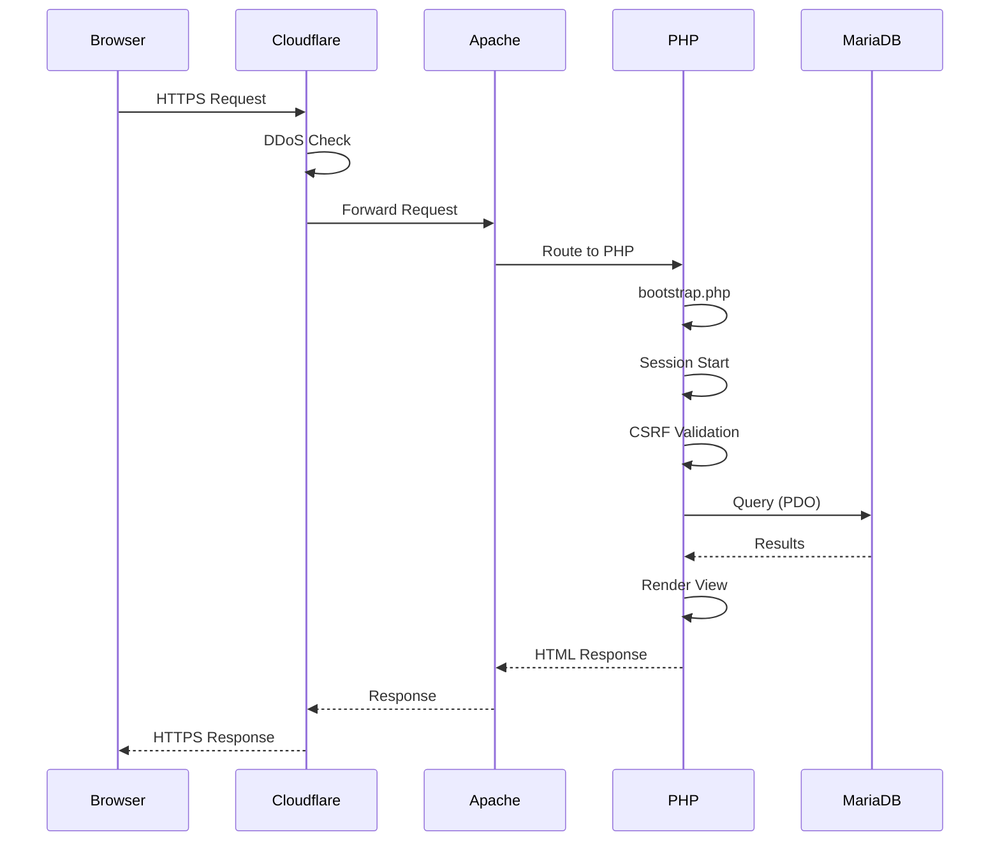

# 🏗️ Arquitetura

## Visão Geral

O BabeStand segue uma arquitetura em camadas com separação clara de responsabilidades.

## 📁 Documentos

| Documento | Descrição |
|-----------|-----------|
| [Diagrama ER](diagrama-er.md) | Estrutura da base de dados |
| [Fluxos](fluxos.md) | Diagramas de fluxo |
| [Estrutura de Ficheiros](estrutura.md) | Organização do código |

## Arquitetura em Camadas

```
┌─────────────────────────────────────────────────────────────┐
│                    CLIENTE (Browser)                        │
│                  HTML/CSS/JavaScript                        │
└─────────────────────────────────────────────────────────────┘
                              │
                              ▼
┌─────────────────────────────────────────────────────────────┐
│                       CLOUDFLARE                            │
│              CDN │ DDoS Protection │ SSL                    │
└─────────────────────────────────────────────────────────────┘
                              │
                              ▼
┌─────────────────────────────────────────────────────────────┐
│                     APACHE + PHP 8.3                        │
├─────────────────────────────────────────────────────────────┤
│  APRESENTAÇÃO       │ Views PHP + Bootstrap 5               │
├─────────────────────────────────────────────────────────────┤
│  CONTROLADORES      │ Páginas públicas/admin/API            │
├─────────────────────────────────────────────────────────────┤
│  LÓGICA NEGÓCIO     │ Classes src/ (Auth, Validator, etc.)  │
├─────────────────────────────────────────────────────────────┤
│  ACESSO DADOS       │ Database.php (PDO)                    │
└─────────────────────────────────────────────────────────────┘
                              │
                              ▼
┌─────────────────────────────────────────────────────────────┐
│                     MARIADB 10.11                           │
│                    36 tabelas │ UTF8MB4                     │
└─────────────────────────────────────────────────────────────┘
```

## Estrutura de Diretórios

```
babestand/
├── config/
│   └── config.php          # Configurações (via .env)
│
├── src/                    # Classes de negócio
│   ├── Auth.php           # Autenticação completa
│   ├── Database.php       # Singleton PDO
│   ├── Session.php        # Gestão de sessões
│   ├── CSRF.php           # Proteção CSRF
│   ├── Validator.php      # Validação de input
│   ├── Notification.php   # Sistema de notificações
│   ├── Cache.php          # Cache em ficheiros
│   ├── TOTP.php           # 2FA Google Authenticator
│   ├── ImageValidator.php # Upload seguro
│   ├── SecurityLogger.php # Logs de segurança
│   └── Services/
│       └── Mailer.php     # Envio de emails
│
├── public/                 # Document root
│   ├── index.php          # Entry point
│   ├── inicio.php         # Homepage
│   ├── veiculos.php       # Catálogo
│   ├── veiculo.php        # Detalhe veículo
│   ├── login.php          # Autenticação
│   ├── assets/            # CSS/JS/Imagens
│   └── uploads/           # Ficheiros carregados
│       ├── avatars/
│       ├── vehicles/
│       └── documents/
│
├── admin/                  # Área administrativa
│   ├── dashboard.php
│   ├── veiculos.php
│   ├── utilizadores.php
│   └── ...
│
├── conta/                  # Área do utilizador
│   ├── perfil.php
│   ├── seguranca.php
│   ├── meus-veiculos.php
│   └── ...
│
├── api/                    # Endpoints REST
│   ├── favorito.php
│   ├── notificacoes.php
│   └── ...
│
├── views/                  # Templates
│   └── layouts/
│       ├── header.php
│       └── footer.php
│
├── templates/              # Templates de email
│   └── emails/
│
├── cron/                   # Tarefas agendadas
│   ├── maintenance-reminders.php
│   ├── notify-favorite-sold.php
│   └── ...
│
└── bootstrap.php           # Inicialização
```

## Fluxo de Request



## Classes Principais

| Classe | Responsabilidade |
|--------|------------------|
| **Auth** | Login, 2FA, password reset, bloqueios |
| **Database** | Singleton PDO, prepared statements |
| **Session** | Gestão de sessões PHP seguras |
| **CSRF** | Geração e validação de tokens |
| **Validator** | Validação de formulários |
| **Mailer** | Envio de emails SMTP |
| **TOTP** | Autenticação Google Authenticator |
| **ImageValidator** | Upload seguro de imagens |
| **SecurityLogger** | Auditoria de eventos |
| **Notification** | Notificações in-app |
| **Cache** | Cache em ficheiros com TTL |

## Padrões Utilizados

| Padrão | Utilização |
|--------|------------|
| **Singleton** | Database, Cache |
| **Factory** | Mailer templates |
| **MVC (simplificado)** | Separação de views |
| **Repository** | Acesso a dados via Database |
