# Diagrama Entidade-Relacionamento

## Diagrama Completo

```mermaid
erDiagram
    %% ===== UTILIZADORES E AUTENTICAÇÃO =====
    roles ||--o{ users : "tem"
    roles {
        int id PK
        varchar name UK
        varchar slug
        varchar description
        datetime created_at
    }
    
    users ||--o{ login_tokens : "tem"
    users ||--o{ login_history : "tem"
    users ||--o{ login_attempts : "regista"
    users ||--o{ login_logs : "regista"
    users ||--o{ user_activity : "tem"
    users ||--o{ favorites : "tem"
    users ||--o{ test_drives : "agenda"
    users ||--o{ reviews : "escreve"
    users ||--o{ contact_messages : "envia"
    users ||--o{ notifications : "recebe"
    users ||--o{ sell_trade_requests : "submete"
    users ||--o{ vehicle_documents : "carrega"
    users ||--o{ vehicle_maintenance : "regista"
    users {
        int id PK
        int role_id FK
        varchar name
        varchar email UK
        varchar password
        varchar phone
        varchar nif
        varchar avatar
        varchar totp_secret
        boolean totp_enabled
        varchar remember_token
        datetime remember_token_expires
        datetime last_login
        boolean is_active
        varchar blocked_reason
        datetime created_at
        datetime updated_at
    }

    login_tokens {
        int id PK
        int user_id FK
        varchar token
        varchar code
        varchar ip_address
        text user_agent
        boolean is_used
        datetime used_at
        datetime expires_at
        datetime created_at
    }

    login_history {
        int id PK
        int user_id FK
        varchar ip_address
        text user_agent
        boolean success
        varchar failure_reason
        datetime login_at
    }

    login_attempts {
        int id PK
        varchar email
        varchar ip_address
        text user_agent
        boolean success
        datetime created_at
    }

    login_logs {
        int id PK
        int user_id FK
        varchar ip_address
        text user_agent
        varchar action
        datetime created_at
    }

    security_logs {
        int id PK
        int user_id FK
        enum event_type
        enum severity
        varchar ip_address
        text description
        json metadata
        datetime created_at
    }

    activity_logs {
        int id PK
        int user_id FK
        varchar action
        varchar entity_type
        int entity_id
        json old_values
        json new_values
        varchar ip_address
        text user_agent
        datetime created_at
    }

    user_activity {
        int id PK
        int user_id FK
        varchar action
        varchar description
        varchar ip_address
        datetime created_at
    }

    email_history {
        int id PK
        int user_id FK
        varchar to_email
        varchar subject
        varchar template
        enum status
        datetime sent_at
        datetime created_at
    }

    %% ===== VEÍCULOS =====
    brands ||--o{ vehicles : "tem"
    brands {
        int id PK
        varchar name UK
        varchar logo
        int service_interval_km
        int service_interval_months
        boolean is_active
        datetime created_at
    }

    vehicle_types ||--o{ vehicles : "classifica"
    vehicle_types {
        int id PK
        varchar name UK
        boolean is_active
    }

    fuel_types ||--o{ vehicles : "usa"
    fuel_types {
        int id PK
        varchar name UK
    }

    vehicle_status ||--o{ vehicles : "define"
    vehicle_status {
        int id PK
        varchar name UK
        varchar color
        boolean show_public
    }

    vehicle_colors ||--o{ vehicles : "tem"
    vehicle_colors {
        int id PK
        varchar name UK
        varchar hex_code
        boolean is_active
    }

    vehicles ||--o{ vehicle_images : "tem"
    vehicles ||--o{ vehicle_features : "possui"
    vehicles ||--o{ vehicle_documents : "tem"
    vehicles ||--o{ vehicle_maintenance : "regista"
    vehicles ||--o{ vehicle_waiting_list : "tem"
    vehicles ||--o{ test_drives : "para"
    vehicles ||--o{ favorites : "em"
    vehicles ||--o{ reviews : "sobre"
    vehicles ||--o{ sell_trade_requests : "para"
    vehicles ||--o{ favorite_sold_notifications : "gera"
    vehicles {
        int id PK
        int brand_id FK
        int vehicle_type_id FK
        int fuel_type_id FK
        int status_id FK
        int color_id FK
        int buyer_id FK
        varchar model
        varchar version
        year year
        varchar color
        int mileage
        int doors
        int seats
        int power_hp
        int engine_cc
        enum transmission
        decimal price
        decimal previous_price
        decimal sold_price
        datetime sold_date
        text description
        json features
        varchar vin
        varchar license_plate
        int views
        boolean is_featured
        boolean is_visible
        datetime created_at
        datetime updated_at
    }

    vehicle_images {
        int id PK
        int vehicle_id FK
        varchar filename
        varchar original_name
        boolean is_primary
        int sort_order
        datetime created_at
    }

    features ||--o{ vehicle_features : "em"
    features {
        int id PK
        varchar name UK
        varchar category
        boolean is_active
    }

    vehicle_features {
        int id PK
        int vehicle_id FK
        int feature_id FK
    }

    %% ===== RESERVAS / TEST DRIVES =====
    test_drive_status ||--o{ test_drives : "define"
    test_drive_status {
        int id PK
        varchar name UK
        varchar color
    }

    test_drives {
        int id PK
        int user_id FK
        int vehicle_id FK
        int status_id FK
        date scheduled_date
        time scheduled_time
        text notes
        text admin_notes
        datetime created_at
        datetime updated_at
    }

    %% ===== INTERAÇÕES =====
    favorites ||--o{ favorite_sold_notifications : "gera"
    favorites {
        int id PK
        int user_id FK
        int vehicle_id FK
        datetime created_at
    }

    favorite_sold_notifications {
        int id PK
        int user_id FK
        int vehicle_id FK
        int favorite_id FK
        boolean notified
        datetime notified_at
        datetime created_at
    }

    reviews {
        int id PK
        int user_id FK
        int vehicle_id FK
        int rating
        text comment
        enum status
        datetime created_at
        datetime updated_at
    }

    contact_messages ||--o{ contact_replies : "tem"
    contact_messages {
        int id PK
        int user_id FK
        int vehicle_id FK
        varchar name
        varchar email
        varchar phone
        varchar subject
        text message
        boolean is_read
        datetime read_at
        varchar ip_address
        datetime created_at
    }

    contact_replies {
        int id PK
        int message_id FK
        int admin_id FK
        text reply
        datetime created_at
    }

    notifications {
        int id PK
        int user_id FK
        varchar type
        varchar title
        text message
        varchar link
        boolean is_read
        datetime read_at
        datetime created_at
    }

    %% ===== VENDAS E NEGOCIAÇÃO =====
    sell_trade_requests ||--o{ negotiation_messages : "tem"
    sell_trade_requests {
        int id PK
        int vehicle_id FK
        int user_id FK
        enum type
        enum status
        text message
        decimal current_offer
        decimal user_counter_offer
        decimal final_price
        text admin_notes
        datetime created_at
        datetime updated_at
    }

    negotiation_messages {
        int id PK
        int request_id FK
        enum sender_type
        int sender_id
        text message
        decimal offer_value
        enum action
        datetime created_at
    }

    %% ===== PÓS-VENDA =====
    vehicle_documents {
        int id PK
        int vehicle_id FK
        int user_id FK
        enum type
        varchar filename
        varchar original_name
        int file_size
        text notes
        datetime created_at
    }

    vehicle_maintenance {
        int id PK
        int vehicle_id FK
        int user_id FK
        enum type
        varchar description
        int mileage
        decimal cost
        date service_date
        date next_date
        int next_mileage
        text notes
        datetime created_at
    }

    maintenance_reminders {
        int id PK
        int vehicle_id FK
        int user_id FK
        enum type
        date reminder_date
        datetime sent_at
    }

    vehicle_waiting_list {
        int id PK
        int vehicle_id FK
        int user_id FK
        varchar email
        varchar name
        varchar phone
        boolean notified
        datetime notified_at
        datetime created_at
    }

    %% ===== SISTEMA / CONFIGURAÇÕES =====
    settings {
        int id PK
        varchar key UK
        text value
        enum type
        varchar description
        datetime updated_at
    }

    site_settings {
        int id PK
        varchar setting_key UK
        text setting_value
        datetime updated_at
    }

    closed_days {
        int id PK
        date date UK
        varchar description
        datetime created_at
    }
```

## Tabelas por Módulo

### 👤 Utilizadores e Autenticação (9 tabelas)

| Tabela | Descrição |
|--------|-----------|
| `roles` | Papéis de utilizador (admin, user) |
| `users` | Dados dos utilizadores |
| `login_tokens` | Tokens 2FA por email |
| `login_attempts` | Rate limiting |
| `login_history` | Histórico de logins |
| `login_logs` | Logs de login |
| `user_activity` | Atividade do utilizador |
| `security_logs` | Eventos de segurança |
| `notifications` | Notificações in-app |

### 🚗 Veículos (10 tabelas)

| Tabela | Descrição |
|--------|-----------|
| `vehicles` | Dados dos veículos |
| `brands` | Marcas automóveis |
| `vehicle_types` | Tipos (carro, mota, etc.) |
| `fuel_types` | Combustíveis |
| `vehicle_status` | Estados (disponível, vendido, etc.) |
| `vehicle_colors` | Cores disponíveis |
| `vehicle_images` | Imagens dos veículos |
| `features` | Características/extras |
| `vehicle_features` | Relação veículo-característica |
| `vehicle_waiting_list` | Lista de espera |

### 📅 Funcionalidades (6 tabelas)

| Tabela | Descrição |
|--------|-----------|
| `test_drives` | Agendamentos |
| `test_drive_status` | Estados do test drive |
| `favorites` | Veículos favoritos |
| `reviews` | Avaliações |
| `contact_messages` | Mensagens de contacto |
| `contact_replies` | Respostas às mensagens |

### 💰 Vendas e Negociação (2 tabelas)

| Tabela | Descrição |
|--------|-----------|
| `sell_trade_requests` | Pedidos de venda/troca |
| `negotiation_messages` | Histórico de negociação |

### 🔧 Pós-Venda (3 tabelas)

| Tabela | Descrição |
|--------|-----------|
| `vehicle_documents` | Documentos do proprietário |
| `vehicle_maintenance` | Histórico de manutenções |
| `maintenance_reminders` | Lembretes enviados |

### ⚙️ Configurações (3 tabelas)

| Tabela | Descrição |
|--------|-----------|
| `settings` | Configurações legacy |
| `site_settings` | Configurações do site |
| `closed_days` | Dias encerrados |

## Estatísticas

| Métrica | Valor |
|---------|-------|
| **Total de Tabelas** | 36 |
| **Tabelas com FK** | 28 |
| **Relações** | 42 |
