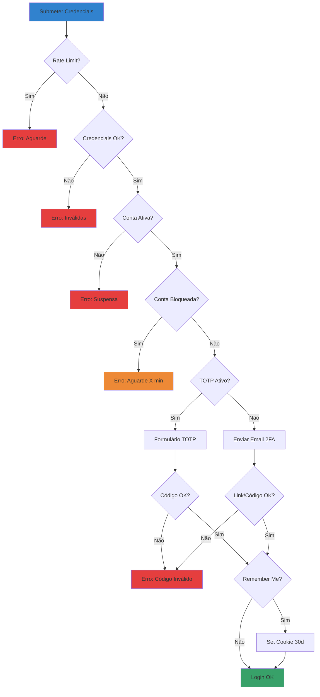
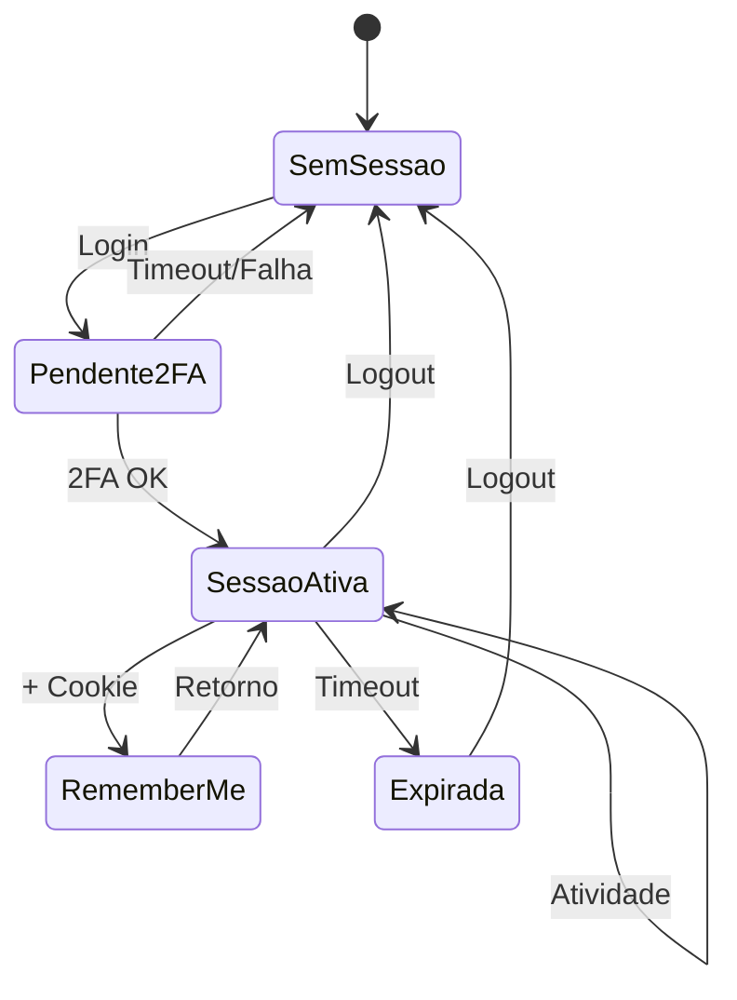
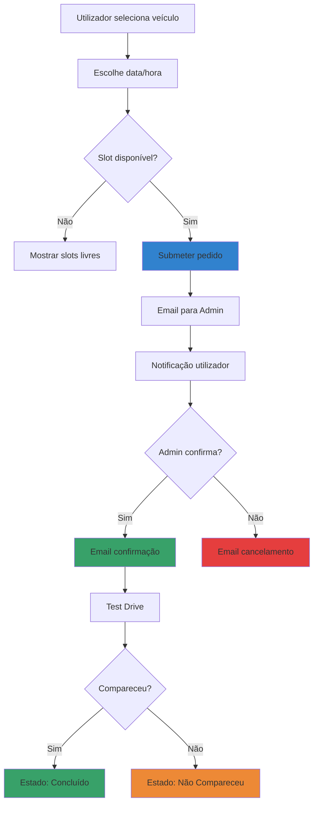
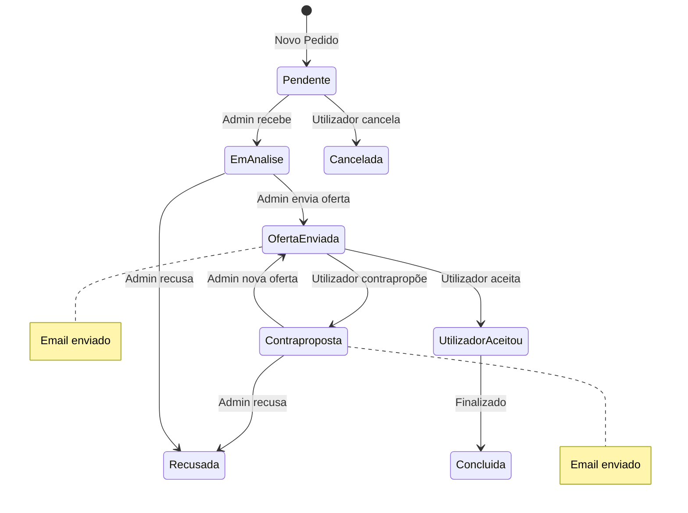
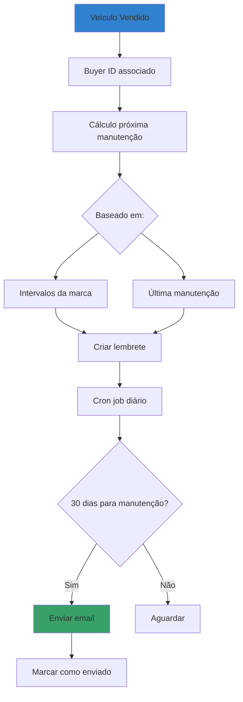
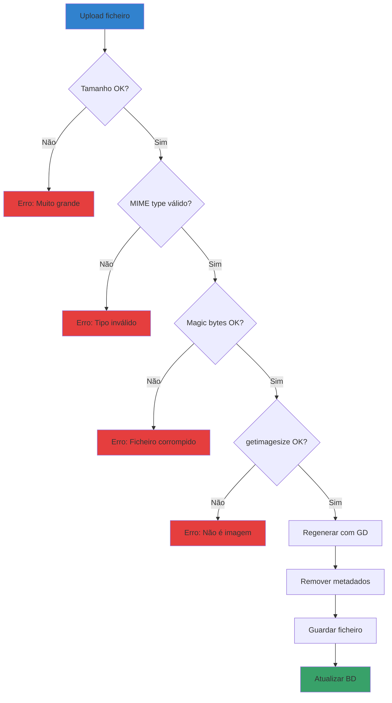
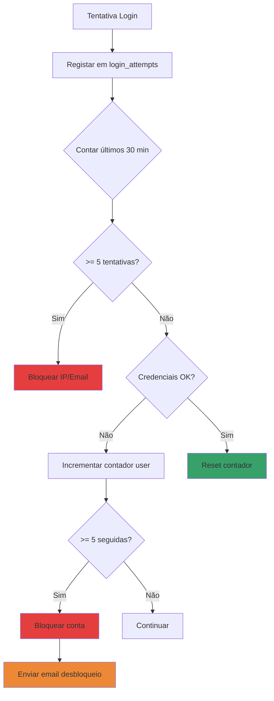

# Diagramas de Fluxo

## Fluxo de Autenticação

## Ciclo de Vida da Sessão

## Fluxo de Test Drive

## Fluxo de Negociação (Venda/Troca)

## Fluxo de Manutenção (Pós-Venda)

## Fluxo de Upload de Imagem

## Fluxo de Rate Limiting

