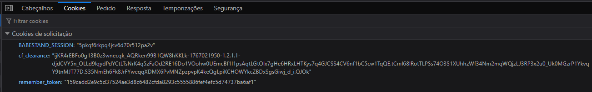
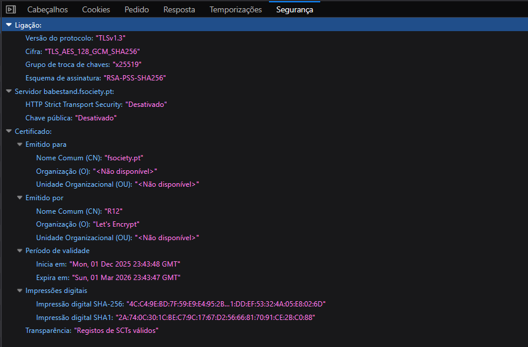

# 🔒 Segurança

O BabeStand implementa múltiplas camadas de segurança seguindo as melhores práticas da indústria.

## 📁 Documentos

| Documento | Descrição |
|-----------|-----------|
| [Headers HTTP](headers-http.md) | Headers de segurança implementados |
| [Autenticação](autenticacao.md) | Sistema 2FA e gestão de sessões |
| [TLS/SSL](tls.md) | Configuração de certificados |
| [Cookies](cookies.md) | Gestão segura de cookies |

## 🛡️ Resumo de Segurança

### Headers HTTP Implementados

| Header | Valor | Propósito |
|--------|-------|-----------|
| `Content-Security-Policy` | `default-src 'self'; script-src 'self' 'unsafe-inline' cdn.jsdelivr.net...` | Prevenção XSS |
| `X-Frame-Options` | `SAMEORIGIN` | Prevenção Clickjacking |
| `X-Content-Type-Options` | `nosniff` | Prevenção MIME sniffing |
| `X-XSS-Protection` | `1; mode=block` | Filtro XSS do browser |
| `Referrer-Policy` | `strict-origin-when-cross-origin` | Controlo de referrer |
| `Permissions-Policy` | `geolocation=(), microphone=(), camera=()` | Restrição de APIs |

### Autenticação

- **Password Hashing**: Argon2ID
- **2FA**: TOTP (Google Authenticator) + Email
- **Rate Limiting**: 5 tentativas, bloqueio 30 minutos
- **Sessões**: Regeneração de ID, timeout configurável
- **Remember Me**: Token seguro com 30 dias

### TLS/SSL

| Parâmetro | Valor |
|-----------|-------|
| **Protocolo** | TLS 1.3 |
| **Cipher Suite** | TLS_AES_128_GCM_SHA256 |
| **Key Exchange** | X25519 |
| **Certificado** | Let's Encrypt |
| **Validade** | Até Março 2026 |

### Proteções Implementadas

| Ataque | Mitigação |
|--------|-----------|
| SQL Injection | Prepared Statements (PDO) |
| XSS | htmlspecialchars() + CSP |
| CSRF | Tokens por sessão |
| File Upload | Validação MIME + Magic Bytes + Regeneração |
| Brute Force | Rate Limiting + Bloqueio de Conta |
| Session Hijacking | Regeneração de ID + Secure Cookies |

## 📊 Evidências

### Headers HTTP (DevTools)

### Cookies de Sessão

### Certificado TLS

## 🔗 Referências

- [OWASP Top 10](https://owasp.org/www-project-top-ten/)
- [Mozilla Security Guidelines](https://infosec.mozilla.org/guidelines/web_security)
- [PHP Security Best Practices](https://www.php.net/manual/en/security.php)
