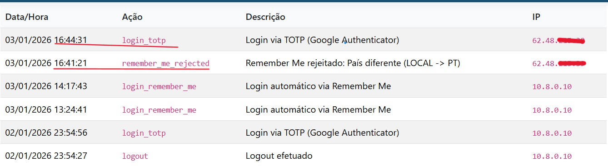
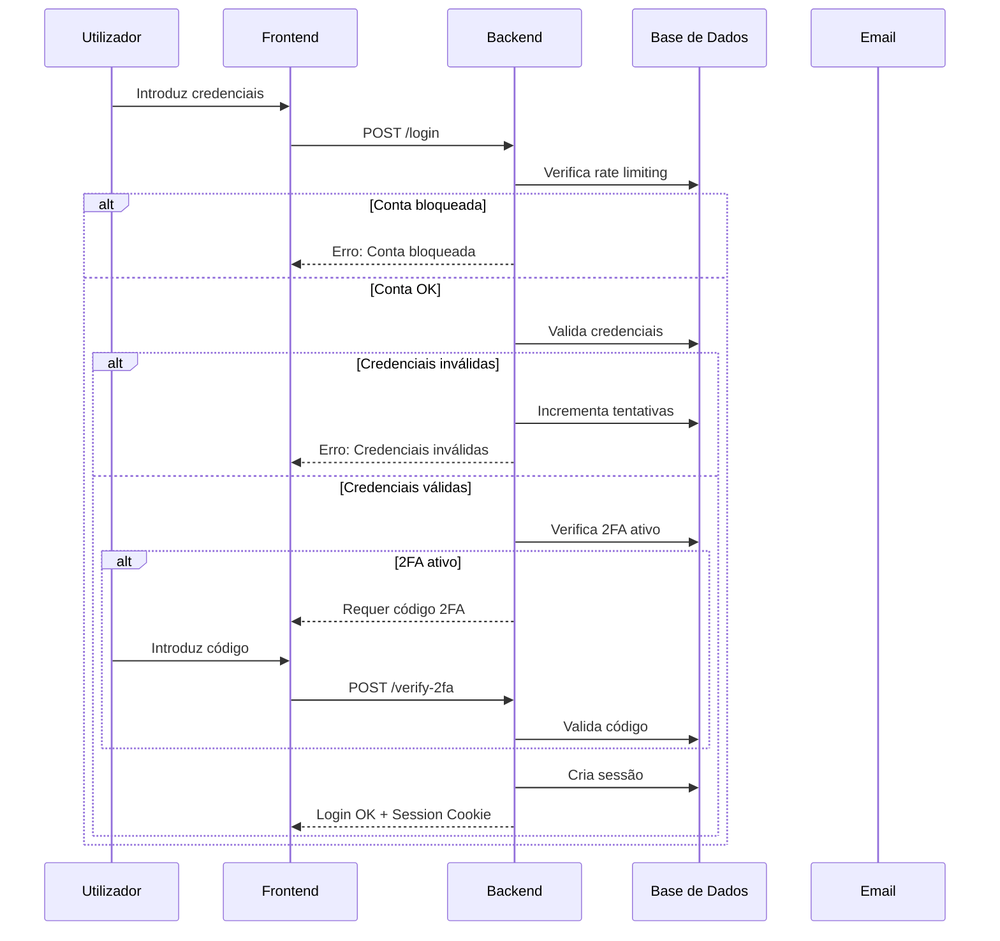

# 🔐 Sistema de Autenticação

O BabeStand implementa um sistema de autenticação robusto com múltiplas camadas de segurança.

## Funcionalidades

### Registo de Utilizadores
- Validação de email único
- Password com requisitos mínimos (8 caracteres, maiúscula, número)
- Hash com **Argon2id** (algoritmo recomendado pela OWASP)
- Verificação de email obrigatória

### Login
- Rate limiting: 5 tentativas → bloqueio 30 minutos
- Bloqueio por conta (não por IP)
- Notificação por email em caso de bloqueio
- Logging de todas as tentativas

### Autenticação de Dois Fatores (2FA)

#### TOTP (Time-based One-Time Password)
- Implementação RFC 6238
- Compatível com Google Authenticator, Authy, etc.
- QR Code para configuração fácil
- Códigos de backup para recuperação

#### Email OTP
- Código de 6 dígitos enviado por email
- Válido por 10 minutos
- Alternativa ao TOTP

### Remember Me
- Token criptograficamente seguro (64 bytes)
- Armazenado com hash na base de dados
- Expiração configurável (30 dias por defeito)
- Cookie com flags `HttpOnly`, `Secure`, `SameSite=Lax`

### Validação de Contexto

O token Remember Me é vinculado ao contexto original de autenticação:

| Parâmetro | Validação |
|-----------|-----------|
| Token | Hash SHA-256 válido |
| IP | Deve corresponder ao original |
| User-Agent | Deve corresponder ao original |
| País | Geolocalização via GeoIP |
```php
// Verificar se IP e User-Agent correspondem
$currentIp = getClientIp();
$currentUserAgent = $_SERVER['HTTP_USER_AGENT'] ?? '';

if ($token['ip_address'] !== $currentIp || 
    $token['user_agent'] !== $currentUserAgent) {
    
    SecurityLogger::log($userId, 'remember_me_rejected', 'warning',
        "País diferente ({$storedCountry} -> {$currentCountry})");
    
    // Invalidar token
    $db->execute("DELETE FROM login_tokens WHERE id = ?", [$token['id']]);
    return false;
}
```

**Proteção**: Mesmo que um atacante roube o cookie `remember_token`, não consegue usá-lo de outro IP ou browser.

### Evidência



A imagem mostra:
- ✅ `login_remember_me` aceite com IP 10.8.0.10 (VPN)
- ❌ `remember_me_rejected` quando IP mudou para 62.48.215.39
- 🔐 Novo `login_totp` obrigatório após rejeição

### Recuperação de Password
- Token único por pedido
- Expiração de 1 hora
- Link de uso único
- Invalidação de tokens anteriores

## Fluxo de Autenticação



## Configuração de Sessões

```php
// bootstrap.php - Configuração segura de sessões
ini_set('session.cookie_httponly', 1);    // Previne acesso via JavaScript
ini_set('session.cookie_secure', 1);       // Apenas HTTPS
ini_set('session.cookie_samesite', 'Lax'); // Proteção CSRF
ini_set('session.use_strict_mode', 1);     // Rejeita IDs não gerados
ini_set('session.gc_maxlifetime', 7200);   // 2 horas de timeout
```

## Classes Envolvidas

| Classe | Responsabilidade |
|--------|------------------|
| `Auth.php` | Lógica de autenticação, 2FA, tokens |
| `Session.php` | Gestão segura de sessões |
| `TOTP.php` | Implementação RFC 6238 |
| `Mailer.php` | Envio de emails (verificação, 2FA, alertas) |
| `SecurityLogger.php` | Logging de eventos de segurança |

## Eventos de Segurança Registados

- `login_success` - Login bem sucedido
- `login_failed` - Tentativa de login falhada
- `login_blocked` - Login bloqueado por rate limiting
- `account_locked` - Conta bloqueada após múltiplas tentativas
- `account_unlocked` - Conta desbloqueada
- `password_changed` - Password alterada
- `2fa_enabled` - 2FA ativado
- `2fa_disabled` - 2FA desativado
- `password_reset_requested` - Pedido de recuperação de password
