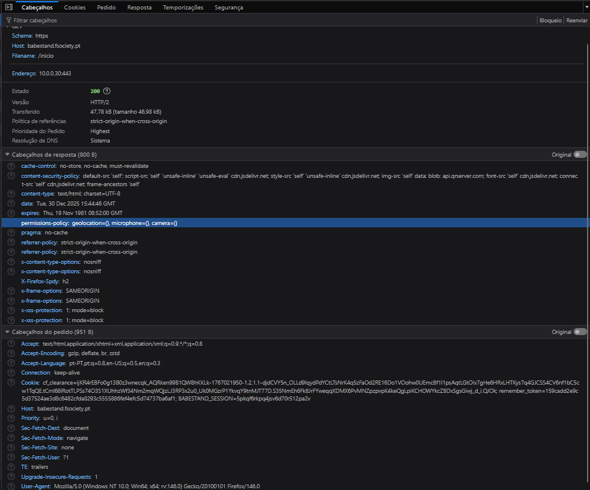

# Headers HTTP de Segurança

## Visão Geral

O BabeStand implementa headers HTTP de segurança para proteção contra ataques comuns. Estes headers são definidos no `bootstrap.php` e aplicados a todas as respostas.

## Headers Implementados

### Content-Security-Policy (CSP)

```
default-src 'self';
script-src 'self' 'unsafe-inline' 'unsafe-eval' cdn.jsdelivr.net;
style-src 'self' 'unsafe-inline' cdn.jsdelivr.net;
img-src 'self' data: blob: api.qrserver.com;
font-src 'self' cdn.jsdelivr.net;
connect-src 'self' cdn.jsdelivr.net;
frame-ancestors 'self'
```

| Diretiva | Valor | Justificação |
|----------|-------|--------------|
| `default-src` | `'self'` | Apenas recursos do próprio domínio |
| `script-src` | `'self' 'unsafe-inline' cdn.jsdelivr.net` | Scripts locais + CDN Bootstrap |
| `style-src` | `'self' 'unsafe-inline' cdn.jsdelivr.net` | Estilos locais + CDN |
| `img-src` | `'self' data: blob: api.qrserver.com` | Imagens + QR codes para TOTP |
| `frame-ancestors` | `'self'` | Prevenção de clickjacking |

### X-Frame-Options

```
X-Frame-Options: SAMEORIGIN
```

Impede que a página seja carregada em iframes de outros domínios, prevenindo ataques de clickjacking.

### X-Content-Type-Options

```
X-Content-Type-Options: nosniff
```

Impede o browser de fazer MIME sniffing, forçando-o a respeitar o `Content-Type` declarado.

### X-XSS-Protection

```
X-XSS-Protection: 1; mode=block
```

Ativa o filtro XSS do browser e bloqueia a página se um ataque for detetado.

### Referrer-Policy

```
Referrer-Policy: strict-origin-when-cross-origin
```

Controla que informação é enviada no header `Referer`:
- **Same-origin**: URL completo
- **Cross-origin**: Apenas origem (domínio)

### Permissions-Policy

```
Permissions-Policy: geolocation=(), microphone=(), camera=()
```

Desativa APIs do browser que não são necessárias:
- Geolocalização
- Microfone
- Câmara

## Código de Implementação

```php
// bootstrap.php
if (!headers_sent()) {
    header("X-Frame-Options: SAMEORIGIN");
    header("X-Content-Type-Options: nosniff");
    header("Referrer-Policy: strict-origin-when-cross-origin");
    header("X-XSS-Protection: 1; mode=block");
    header("Permissions-Policy: geolocation=(), microphone=(), camera=()");
    header("Content-Security-Policy: default-src 'self'; ...");
}
```

## Evidência



## Verificação

Para verificar os headers implementados:

```bash
curl -I https://babestand.fsociety.pt
```

## Referências

- [MDN - Content-Security-Policy](https://developer.mozilla.org/en-US/docs/Web/HTTP/CSP)
- [MDN - X-Frame-Options](https://developer.mozilla.org/en-US/docs/Web/HTTP/Headers/X-Frame-Options)
- [OWASP Secure Headers](https://owasp.org/www-project-secure-headers/)
