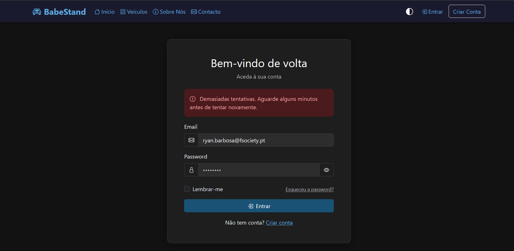
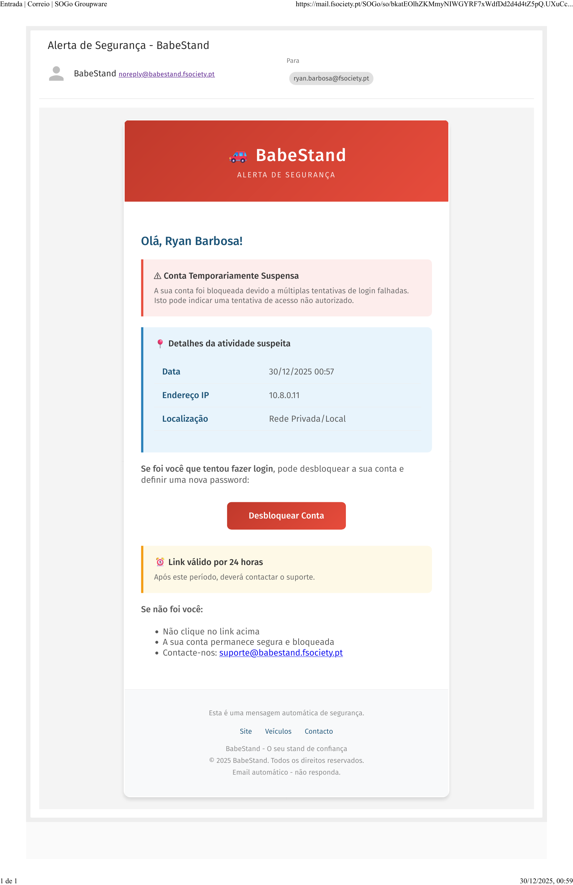
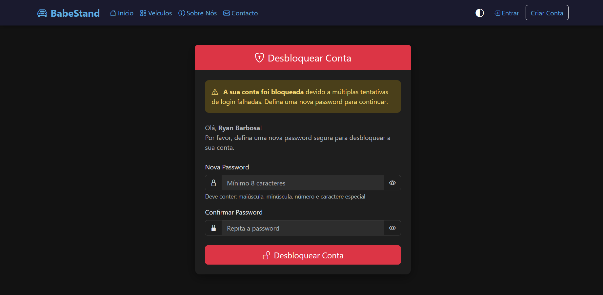
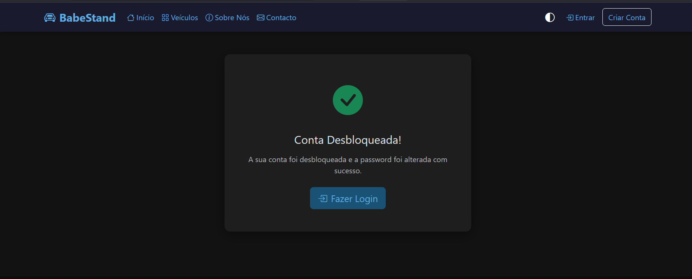
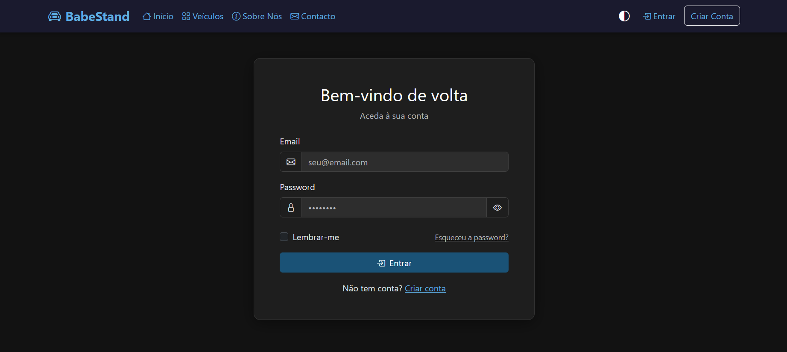
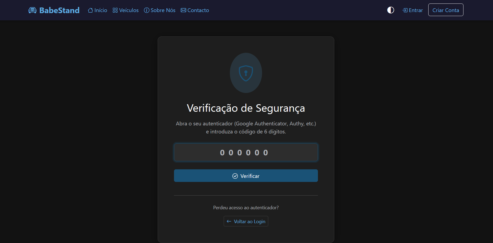

# 🔒 Fluxo: Conta Bloqueada por Atividade Suspeita

Este documento descreve o fluxo completo de proteção contra ataques de força bruta, desde a deteção até ao desbloqueio da conta.

---

## 1️⃣ Deteção de Atividade Suspeita

Quando um utilizador (ou atacante) tenta fazer login com credenciais erradas múltiplas vezes, o sistema ativa o **rate limiting**.

Após **5 tentativas falhadas**, a conta é temporariamente bloqueada e o utilizador vê a seguinte mensagem:



> ⚠️ **"Demasiadas tentativas. Aguarde alguns minutos antes de tentar novamente."**

Neste momento, o sistema:
- Bloqueia a conta por **30 minutos**
- Regista o evento na tabela `security_logs`
- Envia automaticamente um email de alerta ao utilizador

---

## 2️⃣ Email de Alerta de Segurança

O utilizador recebe imediatamente um email alertando sobre a atividade suspeita:



O email inclui:
- **Data e hora** do bloqueio
- **Endereço IP** de onde vieram as tentativas
- **Localização aproximada** (via GeoIP)
- **Botão para desbloquear** a conta
- **Instruções** caso não tenha sido o utilizador

> 🔐 O link de desbloqueio é válido por **24 horas** e só pode ser usado uma vez.

---

## 3️⃣ Página de Desbloqueio

Ao clicar no link do email, o utilizador é direcionado para a página de desbloqueio:



Para desbloquear a conta, o utilizador deve:
- Definir uma **nova password** (obrigatório por segurança)
- A password deve ter no mínimo **8 caracteres**
- Deve conter: maiúscula, minúscula, número e caractere especial

> 💡 Forçar a alteração de password garante que, mesmo que um atacante tenha descoberto a password original, esta já não será válida.

---

## 4️⃣ Confirmação de Desbloqueio

Após submeter a nova password, o sistema confirma o desbloqueio:



> ✅ **"A sua conta foi desbloqueada e a password foi alterada com sucesso."**

O sistema também:
- Remove o bloqueio da conta
- Invalida o token de desbloqueio (uso único)
- Regista o evento de desbloqueio nos logs

---

## 5️⃣ Novo Login

O utilizador é redirecionado para a página de login normal:



Agora pode fazer login com a **nova password**.

---

## 6️⃣ Verificação 2FA (se ativo)

Se o utilizador tiver **TOTP ativado** (Google Authenticator), após inserir as credenciais corretas, é solicitado o código de 6 dígitos:



O utilizador deve:
1. Abrir a app **Google Authenticator** (ou Authy, etc.)
2. Introduzir o código de **6 dígitos**
3. O código é válido por **30 segundos**

---

## 📊 Diagrama do Fluxo

```
┌─────────────────┐
│  5x Password    │
│    Errada       │
└────────┬────────┘
         │
         ▼
┌─────────────────┐     ┌─────────────────┐
│  Conta          │────▶│  Email Enviado  │
│  Bloqueada      │     │  (Alerta)       │
└─────────────────┘     └────────┬────────┘
                                 │
                                 ▼
                        ┌─────────────────┐
                        │  Clica no Link  │
                        └────────┬────────┘
                                 │
                                 ▼
                        ┌─────────────────┐
                        │  Nova Password  │
                        └────────┬────────┘
                                 │
                                 ▼
                        ┌─────────────────┐
                        │  Conta          │
                        │  Desbloqueada   │
                        └────────┬────────┘
                                 │
                                 ▼
                        ┌─────────────────┐
                        │  Login + 2FA    │
                        └─────────────────┘
```

---

## 🛡️ Medidas de Segurança Implementadas

| Medida | Descrição |
|--------|-----------|
| **Rate Limiting** | Máximo 5 tentativas por 30 minutos |
| **Bloqueio Automático** | Conta bloqueada após exceder tentativas |
| **Email de Alerta** | Utilizador notificado imediatamente |
| **Token Único** | Link de desbloqueio válido 24h, uso único |
| **Forçar Nova Password** | Obrigatório alterar password no desbloqueio |
| **Logging** | Todos os eventos registados em `security_logs` |
| **GeoIP** | Localização aproximada do IP nas notificações |

---

## 📁 Ficheiros Relacionados

| Ficheiro | Função |
|----------|--------|
| `src/Auth.php` | Lógica de autenticação e bloqueio |
| `desbloquear-conta.php` | Página de desbloqueio |
| `templates/emails/account_locked.php` | Template do email |
| `src/SecurityLogger.php` | Registo de eventos |
