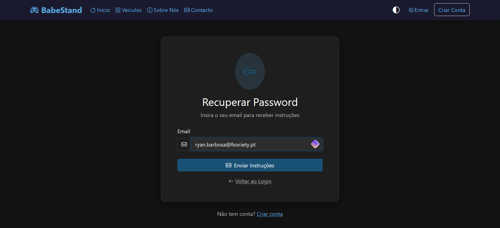
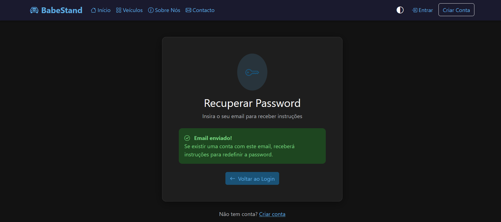
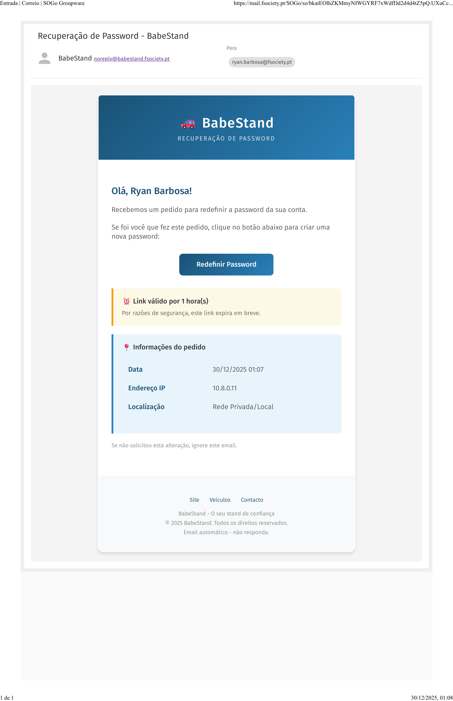
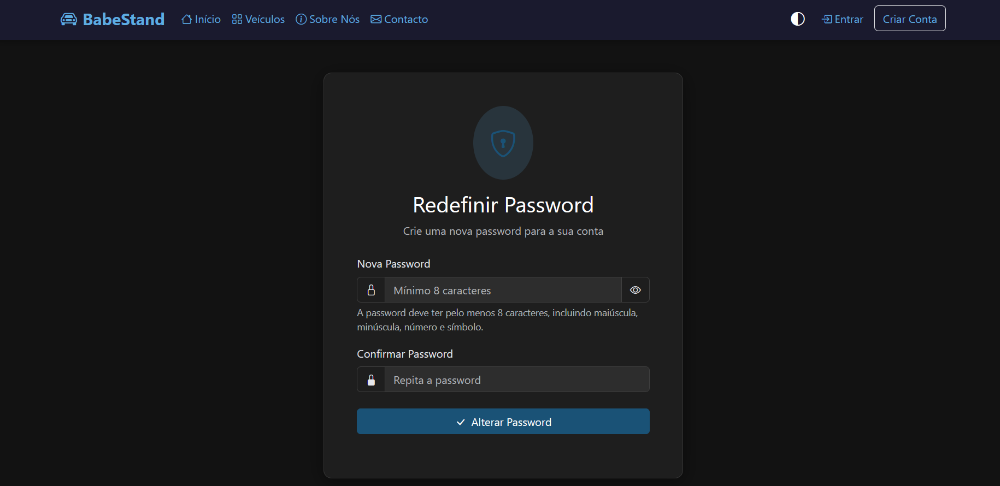
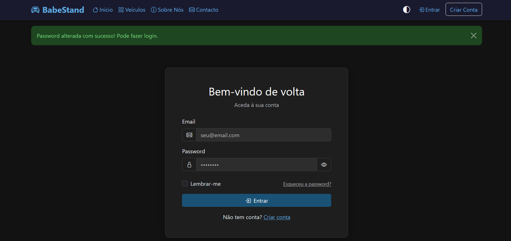

# 🔑 Fluxo: Recuperação de Password

Este documento descreve o fluxo completo de recuperação de password, desde o pedido até à confirmação da alteração.

---

## 1️⃣ Pedido de Recuperação

Quando o utilizador esquece a password, acede à página de recuperação através do link **"Esqueceu a password?"** na página de login.



O utilizador deve:
- Introduzir o **email** associado à conta
- Clicar em **"Enviar Instruções"**

> 🔒 Por razões de segurança, o sistema **não revela** se o email existe ou não na base de dados.

---

## 2️⃣ Confirmação de Envio

Após submeter o formulário, o sistema mostra sempre a mesma mensagem de confirmação:



> ✅ **"Email enviado! Se existir uma conta com este email, receberá instruções para redefinir a password."**

Esta abordagem:
- Previne **enumeração de utilizadores** (um atacante não consegue saber se um email está registado)
- Dá feedback positivo ao utilizador legítimo

---

## 3️⃣ Email de Recuperação

Se o email existir na base de dados, o utilizador recebe um email com o link de recuperação:



O email inclui:
- **Link único** para redefinir a password
- **Validade de 1 hora** (por segurança)
- **Informações do pedido**: data, IP e localização
- **Aviso** para ignorar se não foi o utilizador

> ⏰ O token expira em **1 hora**. Após esse período, é necessário fazer um novo pedido.

---

## 4️⃣ Definir Nova Password

Ao clicar no link do email, o utilizador acede ao formulário de redefinição:



Requisitos da nova password:
- Mínimo **8 caracteres**
- Pelo menos uma **letra maiúscula**
- Pelo menos uma **letra minúscula**
- Pelo menos um **número**
- Pelo menos um **símbolo** (!@#$%^&*...)

O utilizador deve:
1. Introduzir a **nova password**
2. **Confirmar** a password (repetir)
3. Clicar em **"Alterar Password"**

---

## 5️⃣ Confirmação de Alteração

Após alterar com sucesso, o sistema redireciona para a página de login com uma mensagem de sucesso:



> ✅ **"Password alterada com sucesso! Pode fazer login."**

O sistema também:
- **Invalida** o token de recuperação (uso único)
- **Termina** todas as sessões ativas da conta (segurança)
- **Regista** o evento nos logs de atividade

---

## 📊 Diagrama do Fluxo

```
┌─────────────────┐
│  Esqueceu       │
│  Password?      │
└────────┬────────┘
         │
         ▼
┌─────────────────┐
│  Inserir Email  │
└────────┬────────┘
         │
         ▼
┌─────────────────┐     ┌─────────────────┐
│  Email existe?  │─Sim─▶  Enviar Email   │
│                 │     │  com Link       │
└────────┬────────┘     └────────┬────────┘
         │ Não                   │
         ▼                       │
┌─────────────────┐              │
│  Mostrar mesma  │              │
│  mensagem       │◀─────────────┘
│  (segurança)    │
└─────────────────┘
                                 │
                        ┌────────▼────────┐
                        │  Clica no Link  │
                        │  (válido 1h)    │
                        └────────┬────────┘
                                 │
                                 ▼
                        ┌─────────────────┐
                        │  Nova Password  │
                        │  + Confirmação  │
                        └────────┬────────┘
                                 │
                                 ▼
                        ┌─────────────────┐
                        │  Password       │
                        │  Alterada! ✓    │
                        └─────────────────┘
```

---

## 🛡️ Medidas de Segurança Implementadas

| Medida | Descrição |
|--------|-----------|
| **Não revelar existência** | Mesma mensagem para email existente ou não |
| **Token único** | Hash SHA-256, uso único |
| **Expiração** | Token válido apenas 1 hora |
| **Requisitos de password** | Complexidade obrigatória |
| **Invalidar sessões** | Logout de todos os dispositivos |
| **Logging** | Registo de IP e timestamp do pedido |
| **Rate limiting** | Máximo 3 pedidos por hora por email |

---

## 🔐 Detalhes Técnicos

### Geração do Token

```php
// Gerar token seguro
$token = bin2hex(random_bytes(32));  // 64 caracteres hex
$hashedToken = hash('sha256', $token);

// Guardar hash na BD (nunca o token original)
$db->query(
    "UPDATE users SET reset_token = ?, reset_token_expires = ? WHERE email = ?",
    [$hashedToken, date('Y-m-d H:i:s', strtotime('+1 hour')), $email]
);

// Enviar token original no email
$resetLink = SITE_URL . "/redefinir-password.php?token=" . $token;
```

### Validação do Token

```php
// Receber token do URL
$token = $_GET['token'];
$hashedToken = hash('sha256', $token);

// Verificar se existe e não expirou
$user = $db->query(
    "SELECT * FROM users WHERE reset_token = ? AND reset_token_expires > NOW()",
    [$hashedToken]
)->fetch();
```

---

## 📁 Ficheiros Relacionados

| Ficheiro | Função |
|----------|--------|
| `recuperar-password.php` | Formulário de pedido |
| `redefinir-password.php` | Formulário de nova password |
| `src/Auth.php` | Lógica de tokens e validação |
| `templates/emails/password_reset.php` | Template do email |
| `src/Validator.php` | Validação de requisitos da password |
